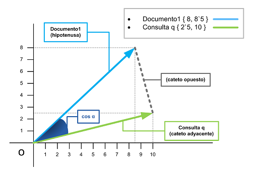

# Moogle!

> Proyecto de Programación I.
> Facultad de Matemática y Computación - Universidad de La Habana.
> Curso 2023.

Moogle! es una aplicación *totalmente original* cuyo propósito es buscar inteligentemente un texto en un conjunto de documentos.

Es una aplicación web, desarrollada con tecnología .NET Core 6.0, específicamente usando Blazor como *framework* web para la interfaz gráfica, y en el lenguaje C#.
La aplicación está dividida en dos componentes fundamentales:

- `MoogleServer` es un servidor web que renderiza la interfaz gráfica y sirve los resultados.
- `MoogleEngine` es una biblioteca de clases donde está implementada la lógica del algoritmo de búsqueda.

## Requisitos e instrucciones para la búsqueda

Necesitas tener instaldo algún navegador y tener a `dotnet` disponible, o equivalente a esto tener .NET CORE 6.0 instalado, para ejecutarlo te debes ubicar en la carpeta del proyecto y ejecutar en la terminal de Linux:

```bash
make dev
```

Si estás en Windows, debes poder hacer lo mismo desde la terminal del WSL (Windows Subsystem for Linux), el comando ultimate para ejecutar la aplicación es (desde la carpeta raíz del proyecto):

```bash
dotnet watch run --project MoogleServer
```
- En primer lugar, el usuario puede buscar no solo una palabra sino en general una frase cualquiera.
- Si no aparecen todas las palabras de la frase en un documento, pero al menos aparecen algunas, este documento también será devuelto, pero con un `score` menor mientras menos palabras aparezcan.
- Algunas palabras excesivamente comunes como las preposiciones, conjunciones, etc., serán ignoradas por completo ya que aparecerán en la inmensa mayoría de los documentos.
- Un símbolo `!` delante de una palabra (e.j., `"hardin !tessa"`) indica que esa palabra **no debe aparecer** en ningún documento que sea devuelto.
- Un símbolo `^` delante de una palabra (e.j., `"hardin ^tessa"`) indica que esa palabra **tiene que aparecer** en cualquier documento que sea devuelto.
- Cualquier cantidad de símbolos `*` delante de un término indican que ese término es más importante, por lo que su influencia en el `score` debe ser mayor que la tendría normalmente (este efecto será acumulativo por cada `*`, por ejemplo `"pan con **chocolate"` indica que la palabra `"chocolate"` tiene dos veces más prioridad que `"pan"`).

## Modelo Vectorial
El modelo de espacio vectorial se basa en el grado de similaridad de una consulta dada por el usuario con respecto a los documentos de la colección cuyos términos fueron ponderados mediante TF-IDF.
### Desglose 
El **Tf-idf** es una medida numérica que expresa cuán relevante es una palabra para un documento en una colección. Es el producto de dos medidas, *frecuencia de término* y *frecuencia inversa de documento*.

Para determinar el valor de **TF** empleo la fórmula: 

$$TF\left(term_n, document_d\right) = \frac{f\left(term_n, document_d\right)}{W_d}$$ 

>* $f$: frecuencia del término n-ésimo en el documento j-ésimo.
>* $W_{d}$: total de palabras del documento.

Mientras que para determinar el **IDF** mi fórmula es:

$$IDF = \begin{cases} 0~~~~~~~~~\text{si el término no aparece en ningún documento}\\ \ln{\frac{|D|}{D_n}~~\text{en cualquier otro caso}} \\ \end{cases}$$


>* $|D|$: cardinal de $D$, o número de documentos en la colección.
>* $D_{n}$: total de documentos en los que aparece el término.

En el modelo de espacio vectorial el **TF-IDF** se emplea como el peso de los términos para cada documento, que refleja la relevancia de los términos del documento de cara a su representatividad en la colección, adquiriendo la forma:

$$Relevance\left(term_n, document_d\right)=TF\left(term_n, document_d\right) \times IDF\left(term_n\right)$$

A este conjunto de números reales, que son los pesos que representan al documento, se les denomina `Vector del documento`, permitiendo su representación en el espacio vectorial y en  consecuencia, su tratamiento matemático. Por ello la formulación del vector se representa de la  siguiente forma:


Sigue lo que se denomina, un Proceso de Vectorización, por el que todos los documentos son representados mediante pesos TF-IDF; la consulta del usuario también requiere de dicho tratamiento. Ello significa que se tiene que ponderar la importancia de los términos de la consulta para poder generar el Vector de la consulta del usuario. En particular para mi consulta esto equivale al inverso de la cantidad de términos que contiene. Este paso es imprescindible para poder efectuar el Proceso de Equiparación de la consulta con los documentos de la colección y determinar cuáles de ellos son más relevantes.

**Proceso de equiparación mediante la fórmula del coseno**:
Existen muchas modalidades de comparación o equiparación mediante similaridad; el proceso de equiparación es posible cuando en el vector de la consulta y en el del documento existen términos coincidentes. De hecho una de las claves del modelo de espacio vectorial es precisamente la posibilidad de determinar el ángulo que forman los vectores del documento y de la consulta que se está comparando, por eso en este caso empleo la fórmula de similitud del coseno:

$$ SimCos(d_{(q)}, q) = \frac{\sum_{n=1} (P_{(n, d)} \times P_{(n, q)})}{\sqrt{\sum_{n = 1} (P_{(n, d)})^{2} \times \sum_{n = 1} (P_{(n, q)})^{2} ))}}$$


